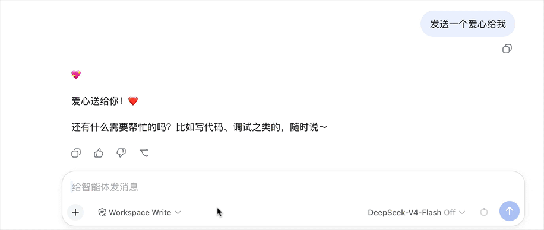

# dsh-prompt-history-plugin

Prompt history navigation for [DeepSeek Harness (dsh)](https://github.com/deepseek-harness/deepseek-harness) web. In the conversation composer, press **↑ / ↓** to browse prompts you have submitted before and fill them back into the input — just like shell history. History is stored locally in your browser (`localStorage`) and shared across sessions.



[中文文档](README.zh.md)

## Installation

### From npm (recommended)

```sh
dsh plugin --profile web add dsh-prompt-history-plugin
```

### From GitHub

```sh
dsh plugin --profile web add github:hotpot-labs/dsh-prompt-history-plugin
```

## Usage

1. Open any conversation in dsh web.
2. With the composer **empty** — or with the **caret at the very beginning** — press **↑** to fill in your most recent prompt; keep pressing **↑** to walk further back, and **↓** to walk forward again.
3. With text in the composer, the first **↑** simply moves the caret to the beginning (default behavior); press **↑** again to enter history navigation. Your unfinished draft is stashed on entry.
4. Press **↓** past the newest entry to restore the stashed draft (or an empty composer) and leave history navigation.
5. While navigating, pressing any printable key, **Enter**, **Backspace** or **Escape** exits navigation mode (the key itself still works as usual).

## Features

- **Shell-style history navigation**: ↑ for older, ↓ for newer, with readline-style stashing — your in-progress draft survives a round trip through history.
- **Automatic recording**: every prompt actually accepted by the host is recorded — regardless of whether you submitted it with Enter or the send button.
- **Cross-session persistence**: history lives in `localStorage` (key `dsh-prompt-history:v1`), capped at 100 entries, deduplicated with most-recent-use first.
- **Zero conflicts**: navigation only starts from an empty draft or with the caret at the very beginning, so it never steals ↑/↓ from the `/` and `@` trigger menus or from normal caret movement in a multi-line draft. IME composition input is always left untouched.
- **No UI chrome**: the plugin renders nothing visible; it only adds behavior to the existing composer.

## Development

### How it works

The plugin is a pure web client bundle. Its client entry registers a component (rendering `null`) into the `conversation.composer.dock` slot, which grants access to the session-scoped standard props:

- `useConversation` (newer cohorts) or `useSession` (0.1.1-rc.2, whose snapshot is the same `ConversationSnapshot`) — subscribed to diff newly appeared `user` nodes; their text blocks are extracted and pushed into the history store. Only submissions accepted by the host are recorded.
- `useInput` — mirrors the current draft so the key handler can read it synchronously.
- `inputActions.setDraft(text)` — writes a history entry back into the composer.

A `document` keydown listener in the **capture phase** intercepts ↑/↓ before the host's own handlers whenever the focus is inside the composer (newer cohorts: the `[data-composer-input]` Lexical contenteditable; 0.1.1-rc.2: the native `<textarea>` inside `[data-composer-card]`) and the navigation preconditions are met.

### Build and test

```sh
npm install
npm run build       # host (tsc) + client (tsdown, lazy-CJS wrapper)
npm run typecheck
npm test
npm pack --dry-run  # verify the tarball only contains lib/ + patch + READMEs
```

Local install into a dsh profile:

```sh
dsh plugin --profile web add ./dsh-prompt-history-plugin
```

## FAQ

**The first ↑ just moves my caret to the beginning — is that expected?**
Yes. With text in the composer, ↑ keeps its default caret movement until the caret reaches the very beginning; the next ↑ enters history navigation. This keeps ↑/↓ from ever conflicting with caret movement or the `/` and `@` trigger menus. Your in-progress draft is stashed on entry and restored when you press ↓ past the newest entry.

**Where is my history stored?**
In your browser's `localStorage` under the key `dsh-prompt-history:v1`. Clearing site data removes it. Nothing is sent anywhere else.

**Are slash commands recorded too?**
Yes — any message that appears as a user node in the conversation is recorded, including messages starting with `/`.
